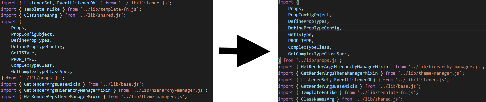

# Prettier Plugin: Sort imports

A prettier plugin that sorts import statements by their length

Example:



## Installation

```sh
npm install --save-dev prettier-plugin-sort-imports
```

## Usage

The plugin will be loaded by Prettier automatically. No configuration needed.

Files containing the string `// sort-imports-ignore` are skipped.
